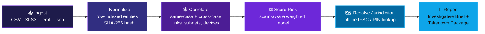
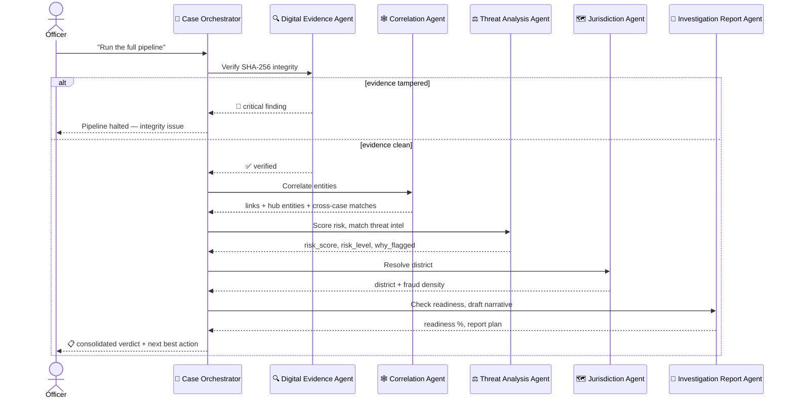
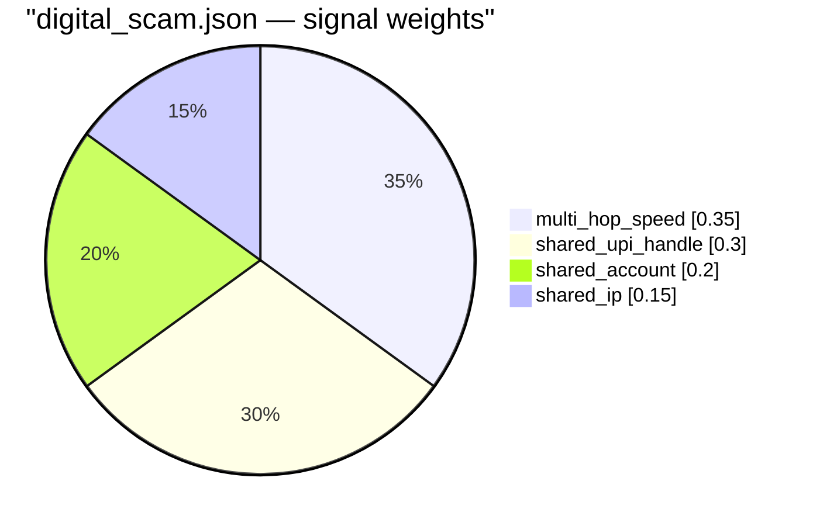
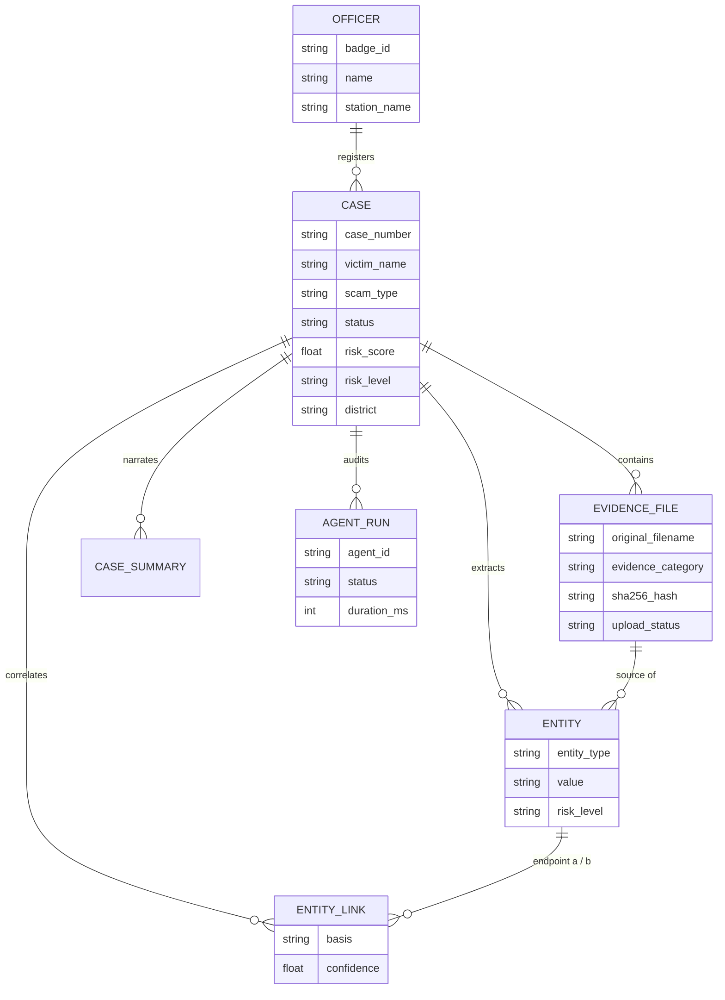

<a id="top"></a>

<div align="center">


### Evidence in. Verdict out.

[](#-60-second-pitch)

<p>
<a href="#-60-second-pitch"></a>
<a href="#-feature-tour"></a>
<a href="#-how-a-case-moves-through-tracex"></a>
<a href="#-getting-started"></a>
<a href="#-try-the-live-demo-flow"></a>
</p>

<p>


</p>

<p>


</p>

</div>

<br/>

> *A cybercrime officer opens a complaint. Somewhere inside a telecom CDR, a UPI settlement sheet, a phishing email, and a suspect's phone dump is the answer to three questions — **who else is in this**, **how dangerous is it**, and **what can I legally do right now**. TraceX exists to answer all three from one screen, on hardware a district cyber cell actually has, without an internet connection.*

<br/>

## 🧭 Table of Contents

<table>
<tr>
<td width="33%" valign="top">

**Understand it**
- [⚡ 60-Second Pitch](#-60-second-pitch)
- [🎯 Why TraceX Exists](#-why-tracex-exists)
- [🪞 Standard Mode vs. Analysis Mode](#-one-engine-two-faces)
- [🔄 How a Case Moves Through TraceX](#-how-a-case-moves-through-tracex)

</td>
<td width="33%" valign="top">

**Explore it**
- [✨ Feature Tour](#-feature-tour)
- [🤖 Meet the Agents](#-meet-the-agents)
- [⚖️ Risk Scoring Engine](#-risk-scoring-engine)
- [🧬 Data Model](#-data-model)

</td>
<td width="33%" valign="top">

**Run it**
- [🏗️ Architecture at a Glance](#-architecture-at-a-glance)
- [🚀 Getting Started](#-getting-started)
- [🎬 Try the Live Demo Flow](#-try-the-live-demo-flow)
- [🧪 Testing](#-testing) · [🔐 Security](#-security-notes)

</td>
</tr>
</table>

---

## ⚡ 60-Second Pitch

<table>
<tr>
<td width="60%" valign="top">

- 📥 **Drop in raw evidence** — CDR/IPDR CSVs, bank/UPI sheets, `.eml` phishing emails, Android forensic JSON dumps.
- 🕸️ **Watch it self-correlate** — phones, IMEI/IMSI, UPI handles, accounts, IPs, emails, URLs — matched *within* the case and *across every other open case*.
- ⚖️ **Get a risk score with a reason** — not a black-box number, a named signal (`shared_upi_handle`, `known_c2_server`, `multi_hop_speed`…).
- 📄 **Walk out with a filing** — a hash-stamped Investigative Brief (Section 91 CrPC) and a Takedown Package (Section 69A IT Act), both PDF, both password-lockable.
- 🤖 **Or just say "run it"** — a 6-agent pipeline can do all of the above autonomously and hand you a consolidated verdict.

</td>
<td width="40%" valign="top">

```bash
# clone
git clone https://github.com/Krishnaa-21/cybersecurity-digital-trust.git
cd cybersecurity-digital-trust

# backend
cd backend && pip install -r requirements.txt
cp .env.example .env && uvicorn app.main:app --reload

# frontend (new terminal)
cd frontend && npm install
cp .env.example .env && npm run dev
```

**→ `http://localhost:5173`**
`MP-IO-4471` / `demo1234`

</td>
</tr>
</table>

> [!IMPORTANT]
> Every capability above — ingestion, correlation, scoring, jurisdiction lookup, PDF generation, and the chat assistant — runs **fully offline**. There is no mandatory external API, no cloud dependency, and no paid key anywhere in the default path.

<p align="right"><a href="#top">↑ back to top</a></p>

---

## 🎯 Why TraceX Exists

| If TraceX did this the "obvious" way… | …it does this instead, and here's why |
|---|---|
| Score risk with a trained ML model | **Rule-based, weighted signals.** Every score traces back to a named reason a magistrate can read. A model that can't explain itself doesn't survive cross-examination. |
| Link entities if they appear in the same *file* | **Row-level co-occurrence.** Two entities only link because they shared the *same CDR row or the same bank transaction* — not because they were merely present somewhere in the same spreadsheet. |
| Hard-code scam logic | **JSON weight profiles per scam type** (`digital_scam`, `phishing_vishing`, `malicious_apk`). Retune the entire scoring engine by editing a config file — zero redeploys. |
| Require an LLM to function | **Offline-first AI.** The chat assistant and case narratives are answered straight from the case database. An LLM key is optional polish, never a dependency — if it's slow or absent, TraceX falls back automatically. |
| Trust the AI blindly | **Full chain-of-custody.** SHA-256 at upload, re-verified by an agent before analysis. Every autonomous agent run is a persisted, timestamped, auditable record. |

<p align="right"><a href="#top">↑ back to top</a></p>

---

## 🪞 One Engine, Two Faces

<a id="-one-engine-two-faces"></a>

TraceX ships **two complete UI skins over one backend**, switchable instantly at runtime:

<table>
<tr>
<th width="50%">🏛️ Standard Mode <sub><i>(default)</i></sub></th>
<th width="50%">🌓 Analysis Mode</th>
</tr>
<tr>
<td valign="top">

An accessible, official-portal presentation for officers who need clarity over flair.

- High-contrast toggle
- 3-step font-size scaling (small / normal / large)
- English ⇄ Hindi language switch
- Plain-language, formal layout

</td>
<td valign="top">

A dark SOC (security-operations-center) theme for deep investigative work.

- Interactive network graph
- Dense, information-rich tables
- Terminal-adjacent aesthetics
- Built for analysts living in the data all day

</td>
</tr>
</table>

Both skins point at the **same routes** (Dashboard · Correlation Graph · Reports · Agents) and the **same design-token file**, so nothing visually drifts between them — flip the switch, keep your place.

<p align="right"><a href="#top">↑ back to top</a></p>

---

## 🔄 How a Case Moves Through TraceX



Every stage above is both a **directly callable backend service** and a step an **autonomous agent** can run on its own — an officer can work through the console step-by-step, or hand the whole case to the Case Orchestrator and let it run start to finish.

<p align="right"><a href="#top">↑ back to top</a></p>

---

## ✨ Feature Tour

<table>
<tr><td width="50%" valign="top">

### 📥 Multi-format Ingestion
Telecom CDR/IPDR, bank/UPI sheets, `.eml` emails, and Android APK forensic dumps — each with a dedicated parser that fuzzy-matches column headers (`msisdn`, `a_party`, `dialled_number`…) so messy real-world exports still normalize cleanly.

### 🕸️ Entity Correlation Engine
Same-value matches *and* relational pivots — shared IMEI↔phone on the same call row, shared account↔UPI on the same transaction, `/24` IP-subnet clustering — computed via inverted row/prefix indexes instead of brute-force O(n²) scans, so it stays fast as cases grow.

### ⚖️ Scam-Aware Risk Scoring
Three hot-swappable JSON weight profiles, a 0–100 score with a plain-English reason, and a **+15 cross-case escalation bonus** when a suspect's entities resurface in another open investigation.

</td><td width="50%" valign="top">

### 🗺️ Offline Jurisdiction Mapping
IFSC-prefix and PIN-prefix → district lookups, entirely bundled — no geocoding API call ever leaves the machine. Feeds a district-wise fraud-density heatmap.

### 📄 Legal-Grade Reporting
A one-page **Investigative Brief** (Section 91 CrPC freeze directives) and a **Takedown Package** (Section 69A IT Act, cross-matched against bundled threat-intel feeds) — both SHA-256-stamped, both optionally password-protected.

### 💬 Offline-First AI Assistant
A floating chat widget answers case questions from the database directly. Configure an LLM key and it phrases the same grounded facts more naturally — skip it, and nothing breaks.

</td></tr>
</table>

<details>
<summary><b>🔬 Want the engineering detail behind each feature? Click to expand.</b></summary>

<br/>

- **Row provenance everywhere** — every ingested row keeps its `row_index`, so correlation never invents a link between two entities that merely happened to live in the same file.
- **Confidence-scored link bases** — `shared_upi_handle` @ 0.95, `shared_phone` @ 0.9, `shared_ip_subnet` @ 0.4 — every edge in the graph is explainable on inspection, not a mystery weight.
- **A hand-built network graph** — the interactive correlation graph has zero heavyweight graph-visualization dependency; it's purpose-built for this dataset shape.
- **Individually risk-tagged entities** — not just the case, but *each account or phone* is tagged Low/Medium/High from its strongest link confidence or anomaly flag, so an officer sees exactly what's driving the danger rating.
- **Accessibility as a first-class feature, not an afterthought** — high-contrast mode, font scaling, and English/Hindi localization ship in Standard Mode by default.

</details>

<p align="right"><a href="#top">↑ back to top</a></p>

---

## 🤖 Meet the Agents

Six specialist agents, each independently callable, each fully auditable — orchestrated end-to-end by one conductor:



<details open>
<summary><b>📋 Agent registry</b></summary>

<br/>

| # | Agent | Role | Access |
|---|---|---|---|
| 1 | 🔍 **Digital Evidence Agent** | Re-checks SHA-256 hashes, processing status, category coverage, duplicates | Read-only |
| 2 | 🕸️ **Correlation Agent** | Runs entity correlation, rebuilds the graph, flags hub entities and cross-case matches | Updates case |
| 3 | ⚖️ **Threat Analysis Agent** | Re-scores risk, profiles high-risk entities, matches threat-intel feeds | Updates case |
| 4 | 🗺️ **Jurisdiction Agent** | Resolves district from IFSC/PIN evidence, situates in fraud-density map | Updates case |
| 5 | 📄 **Investigation Report Agent** | Checks report readiness, drafts case narrative, recommends filings | Updates case |
| 🧭 | **Case Orchestrator** | Plans and runs all of the above in order — halts instantly on integrity failure | Updates case |

</details>

> [!NOTE]
> The orchestrator **stops the pipeline cold** the moment the Digital Evidence Agent flags a critical integrity problem. No downstream agent ever analyzes evidence that can't be trusted — that's a hard rule, not a suggestion.

<p align="right"><a href="#top">↑ back to top</a></p>

---

## ⚖️ Risk Scoring Engine

```
score       = Σ (signal_weight × signal_score) / Σ (signal_weights)     ∈ [0, 100]
risk_level  = HIGH    if score ≥ 70
              MEDIUM  if 40 ≤ score < 70
              LOW     if score < 40

              + 15-point escalation if any entity cross-matches another open case
```

Each scam type loads its own weight profile — swap the JSON, retune the model, no redeploy:



<details>
<summary><b>📡 All nine scoring signals</b></summary>

<br/>

`multi_hop_speed` · `shared_upi_handle` · `shared_account` · `shared_ip` · `shared_imei` · `high_risk_permissions` · `known_c2_server` · `spoofed_caller_pattern` · `high_call_velocity`

Every signal returns both a 0–100 sub-score *and* a human-readable description — the highest-contributing signal becomes the case's `why_flagged` rationale, verbatim.

</details>

<p align="right"><a href="#top">↑ back to top</a></p>

---

## 🧬 Data Model



<p align="right"><a href="#top">↑ back to top</a></p>

---

## 🏗️ Architecture at a Glance

<div align="center">

</div>

<br/>

| Layer | Stack |
|---|---|
| **Frontend** | React 18 · React Router · Vite · Tailwind CSS · lucide-react — no heavyweight graph library; the network graph is hand-built |
| **Backend** | FastAPI · SQLAlchemy · pandas / openpyxl (parsing) · networkx (graph building) · ReportLab / WeasyPrint (PDF) |
| **Auth** | python-jose (JWT) + passlib/bcrypt |
| **AI** | Rules-first chat engine; optional LLM bridge (any OpenAI-compatible endpoint) |

<details>
<summary><b>📁 Full project layout</b></summary>

```text
backend/
  app/
    api/routes/        # auth, cases, evidence, correlation, geo, reports, chat, agents
    core/               # config, JWT/password security
    db/                 # SQLAlchemy models, seed data, demo case seeding
    services/
      ingestion/        # telecom, bank/UPI, email, APK parsers + router
      correlation/      # entity correlation engine + graph builder
      risk/             # scoring engine + per-scam-type weight profiles
      geo/               # IFSC/PIN district resolution + heatmap
      reports/          # PDF generation (Investigative Brief, Takedown Package)
      agents/           # 6-agent pipeline + orchestrator + audit registry
      ai/                # rules-based chat engine + optional LLM bridge + narratives
  tests/                # pytest: agents, correlation, risk, geo, reports, chat, auth
frontend/
  src/
    pages/              # Analysis Mode pages
    components/standard/  # Standard Mode page variants + shell
    components/         # NetworkGraph, ChatWidget, HeatmapGrid, EvidenceTray …
    context/            # ModeContext — Standard/Analysis, accessibility, language
    config/             # standardPortal.js — Standard Mode copy + i18n strings
    routes/             # AppRouter — mode-aware routing
ppt/                    # EPINOIA pitch-deck source + generator scripts
```

</details>

<p align="right"><a href="#top">↑ back to top</a></p>

---

## 🚀 Getting Started

<details open>
<summary><b>🐍 Backend</b></summary>

```bash
cd backend
python -m venv venv
source venv/bin/activate        # Windows: .\venv\Scripts\activate
pip install -r requirements.txt
cp .env.example .env
uvicorn app.main:app --reload
```

Starts at **`http://localhost:8000`**. First launch auto-seeds a default officer and four pre-correlated demo cases across every risk tier and scam type.

</details>

<details>
<summary><b>⚛️ Frontend</b></summary>

```bash
cd frontend
cp .env.example .env
npm install
npm run dev
```

Opens at **`http://localhost:5173`**.

</details>

<details>
<summary><b>🧠 Optional: let an LLM phrase the AI assistant's answers</b></summary>

<br/>

The assistant works fully offline by default. To layer a configured LLM on top of the same grounded case data, set in `backend/.env`:

```env
AI_SUMMARY_API_KEY=<your key>          # leave as the placeholder to keep the LLM off
AI_SUMMARY_API_URL=https://api.groq.com/openai/v1/chat/completions
AI_SUMMARY_MODEL=openai/gpt-oss-20b
AI_CHAT_TIMEOUT_SECONDS=60
```

> [!TIP]
> If the LLM is slow, rate-limited, or unreachable, TraceX transparently falls back to the rules-based answer with a short note. The officer is never left without a response.

</details>

<p align="right"><a href="#top">↑ back to top</a></p>

---

## 🎬 Try the Live Demo Flow

1. **Start both servers** (`:8000` backend, `:5173` frontend) as above.
2. **Log in** — `MP-IO-4471` / `demo1234`.

   > [!WARNING]
   > These are seeded demo credentials for local evaluation only — rotate `JWT_SECRET` and every seeded password before any real deployment.

3. From **Home**, click **"+ New investigation"** → enter a victim name → pick a scam type → upload the sample bundle at `backend/data/sample/` (`mock_cdr.csv`, `mock_bank_upi.xlsx`, `mock_apk_dump.json`, `mock_email.eml`).
4. Click **"Find connections & view graph"** — correlation and risk scoring run live; explore the network graph, filter by entity type, inspect edge confidence rationales.
5. Open **Reports** — generate a password-protected Investigative Brief and Takedown Package, each SHA-256-stamped.
6. Open **Agents** — run the full 6-agent pipeline on the case, or just ask the chat widget what's going on.

<p align="right"><a href="#top">↑ back to top</a></p>

---

## 🧪 Testing

```bash
cd backend
pytest
```

Coverage spans authentication, ingestion, entity correlation, risk scoring, geo/jurisdiction resolution, report generation, the agent pipeline, and both the rules-based and LLM-backed chat paths.

<p align="right"><a href="#top">↑ back to top</a></p>

---

## 🔐 Security Notes

- Passwords hashed with **bcrypt**; sessions authenticated via **JWT bearer tokens**.
- Evidence integrity enforced end-to-end: **SHA-256 at upload**, re-verified by the Digital Evidence Agent before any downstream analysis proceeds.
- No evidence or case content leaves the machine unless an LLM key is explicitly configured — and even then, only the minimal grounded context needed to phrase an answer is sent.

<p align="right"><a href="#top">↑ back to top</a></p>

---

## ⭐ Star History

<div align="center">
<a href="https://star-history.com/#Krishnaa-21/cybersecurity-digital-trust&Date">
  
</a>
</div>

<p align="right"><a href="#top">↑ back to top</a></p>

---

## 🤝 Contributing

Issues and pull requests are welcome — fork the repo, create a feature branch, and open a PR. If you're proposing a larger change (a new evidence parser, a new scam-type risk profile), open an issue first so it can be discussed against the scoring/correlation design above.

## 📜 License

Released under the [MIT License](./LICENSE).

<br/>

<div align="center">

*Built for investigators who need answers, not another dashboard to babysit.*


</div>